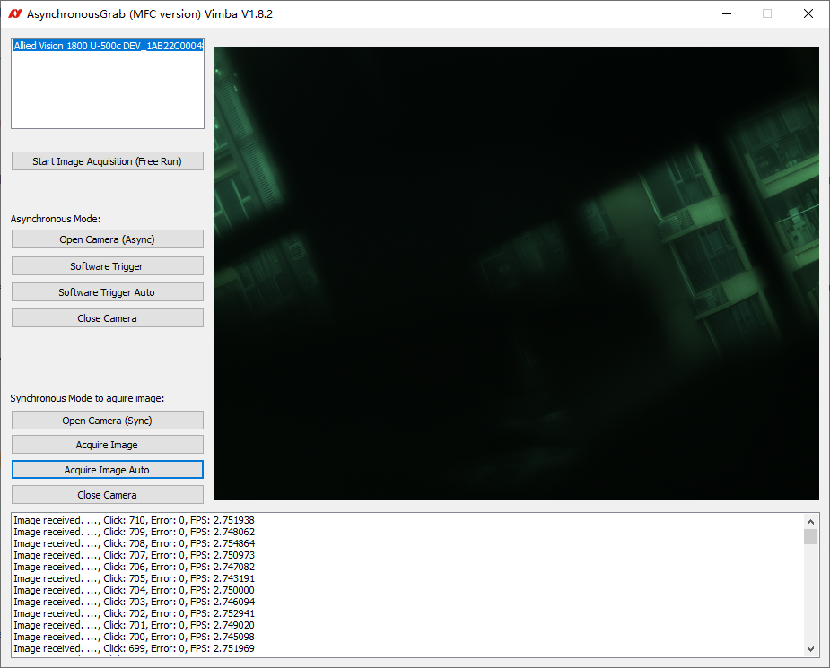
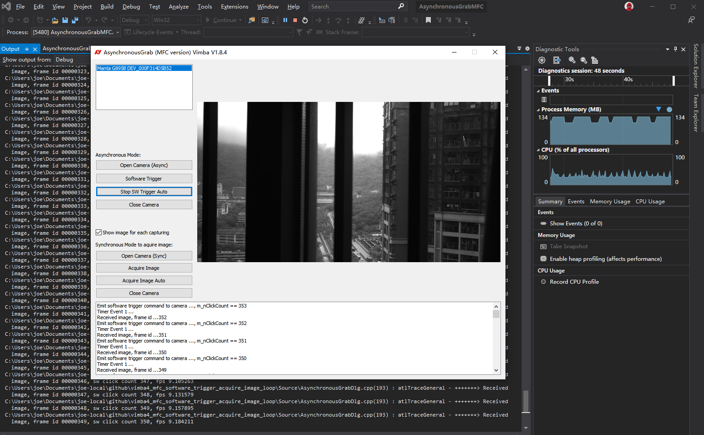

# vimba4_mfc_software_trigger_acquire_image_loop
Single image taking methods in Sync and Async modes.
Specially, Alvium 1800 U-500c, Manta G895B passed the test.  
本例程主要实现用回调异步方式获取软件触发所拍摄的图片。  

## Vimba SDK
Vimba 5.0 C++ code based on example:
`C:\Users\Public\Documents\Allied Vision\Vimba_5.0\VimbaCPP_Examples\SynchronousGrab\MFC`

## 编译方法
本例程使用Vimba 5.0，其它版本也可以，但是需要修改`AsynchronousGrabMFC.vcxproj`中所有`5.0`为本地对应vimba 版本号，例如`4.2`等。

## Screenshot
### 同步软件触发采集

### 异步回调软件触发采集

